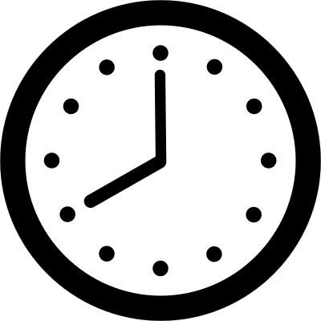
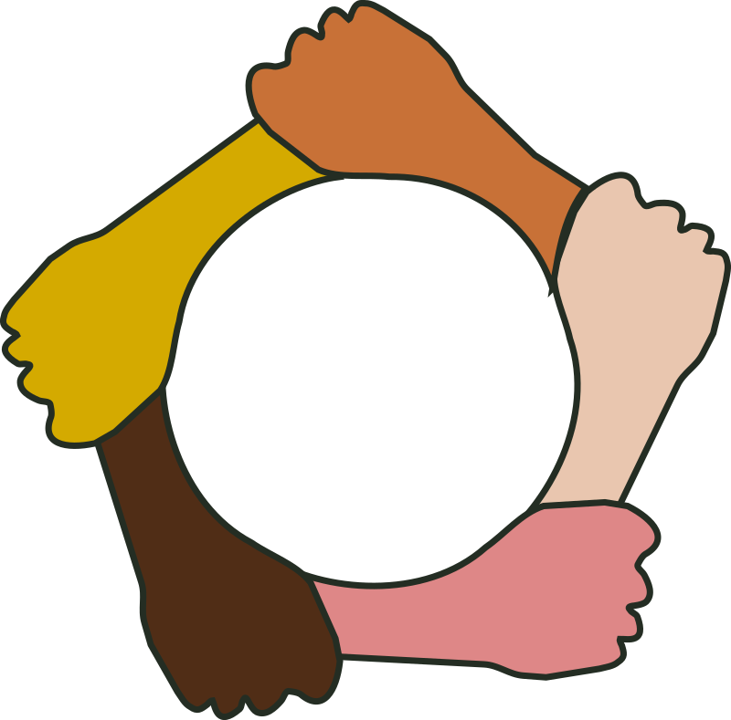

# Fragment Forge (Single-Player) v0.10

You're a newbie coder who's trying to become known for his demo effect skills, and decided to try and compete in a few prestigious demoparty competitions.

This is a card Game, where you're trying to build up the skill set to create the best demo you can during each "round" or Competition. The objective is to reach your Cred goal until the end of the third competition.

## Terminology:

* Cred: A slang for "Credibility". How accepted you are as a coder in the demoscene. Effectively Victory Points
* Kudos: Your social credit with other members of the demoscene. How much you have helped others determines how much they're willing to help you back.
* Time: How much time you have to complete you demo in each Competition
* Skill: How good you are at writing Fragment Shaders.
* Motivation: How motivated you are to improve your demo. The cost to draw new cards is affected by this amount.
* Shader: A type of card which adds value to your demo. See Card Types.
* Resource: A type of card which provides supporting effects. See Card Types.
* Prep: A type of card which rerpesents you **prep**aring for the competition. See Card Types.
* Install: To play a card on the board
* Value: How impressive a Shader is or how Impressive your demo is.
* Demo: Each Installed Shader adds it value to your total for this competition. The total value amount of installed Shaders is your demo value.
* Competition: Effectively, a "round". See (#competitions)

## Card Types:

All cards have a few values which determine how you can play them and what they do. Where you see an icon, it is used to represent that value on the card.

* Name: The name of the card is on the very top.
* Tags: Any special keywords related to this card. Some other cards might look for cards with these tags
* Abilities: The main text of the card. It explains special rules caused by this card. Abilities on cards always override rules specified in this document!
*  Time: How much time it takes to play or install this card
*  Kudos: How many kudos it takes to play or install this card
*  cred_req: How much cred you need to have before you can play this card
*  motivation_req: How much motivation you need to have before you can play this card

### Shader

Shaders (AKA Fragment Shaders) are the core component of any good demo effect.  They use the following extra fields

*  skill_req: How much skill is required to develop this shader. Having 1 less skill means significantly more time. Having 2+ less skill means the shader is impossible for you.

### Resources

Resources are people, knowledge, jobs and other thing which are peripherally useful for creating a good demo.

### Prep

Prep cards are events and actions you take while working on your demo.

## Rules

### Game Goal

The game goal is to amass a specified amount of Cred, based on the difficulty. The amount you need is written to the left of the Competition details

The game will end immediately after you achieve your goal, or after you end your last competition. Then it will inform you if you've won or lost.

### Hand

When you start the game, you'll draw 5 cards to start with. You can play any card by paying it's time and kudos costs. If a card is playable, it will be highlighted white.
If it's highlighted green, it's playable with a discount. If it's highlighted yellow, it's playable with an increase in cost.

If highlighted red, it's not playable.

Check the cost breakdown to see what modifies a card's cost and why. Card which alter the cost will be mentioned in the breakdown.

You can draw more cards by double-clicking on your deck to the left. Each card you draw, costs time (representing the effort of seeking new information on the net). The amount of time is dependent on your motivation and the
amount of cards already in your hand. To draw cards up to your motivation, costs 1 time, Cards over your motivation cost 2 time (representing the overheads of onboarding too many projects). Your maximum hand-size is 10.

If your deck runs out, nothing happens, but you cannot draw anymore cards.

To play a card from your hand, either double click on it, or drag it to the board. If it's a Prep, it will be discarded after being used. Otherwise it will be Installed. You can specify the install position by dragging it to the spot you want in the correct grid for the type. You can play more than 1 card with the same name, unless it has the 'Unique' tag.

Shaders are a bit special to pay for.
* If you have as much skill as the shader's skill_req, then you can play it with the time cost written on it.
* If you have 1 less skill than the shader, then you have to pay double its time cost + one, (representing the effort of trying to develop something exceeding your talents)
* If you have more skill than the shader, then you reduce its time cost by 1 for each skill you have more, to a minimum of half.

### Board

Whenever you play a Shader or Resource, you Install it on your board. You have enough space for 12 Shaders and 12 Resources. If you run out of space, you cannot play anymore. You can drag Installed cards around to reorganize
them to your liking.

At the end of each competition (i.e. round), all shaders will be discarded. This represents starting effort on a new demo for the next competition.
Some resources might be discarded as well, but they will mention it when they do so.

Some cards might have abilities while Installed. Double-click on them to use them.

### Competitions

To start the game, press the "Start Competition" button. It will give you your initial cards.

In the top middle part, you will see details about the competition.
* Each competition provides an amount of Time you can use to create your demo. When this runs out, you have to move to the next competition.
* Each competition might have some special rules as well. They will be written in the yellow textbox.
* Each competition has 3 placements you can achieve, from 3rd to 1st. Each of them gives more Cred for reaching it, but requires more Demo value. Once you achieve a placement, it will be highlighted green.
* Each subsequent Competition increases the amount of Cred you get by placing well within it, but also the placement requirements

Once you run out of time (or you don't want to spend any more), press "Next Competition". In the standard game mode, you take part in 3 competitions.
You can see on which competition you are on the left of the Competition Details.

Be aware: If you do not make any placement in the competition, you will lose 2 motivation. However if you earn the first place, you will instead gain 1 motivation!

### Tags

Most of the cards have tags assigned to them, which tend to specify what kind of effects it has. However some tags also have their own special effects. These effects will be displayed when you mouse over the card. 

The following tags have built-in effects on their cards.

* Unique: Only one card with this name can be Installed
* Restricted: You can only have 1 of each restricted card in your deck
* Collaborator: Discarded at the end of the current competition
* Reputation: Can only have 1 Reputation installed

### Losing the Game

There is only one loss condition in the game, and that is running out of motivation. If your motivation ever drops to 0, you immediately lose the game, as you drop out of all further competitions!

### Deckbuilding

Before you can play a game, you need to craft a deck to play with. There are a few restrictions on making your deck

#### Affinities

There's three loose affinities of people, grouped by approach to the demoscene. 

*(all names provisional)*

* Fractal Minds: They are into the demoscene for the joy of making mathematic art and are interested in fancy algorithms and awesome displays. Whenever you mind is blown, a Fractal Mind was probably behind the explosion.
* Zippers: The minimalists of the bunch. They are keen on reducing the size of their code to the absolute minimum, just because they can. They can cram an absurd amount of power in a short amount of time and space. Their shortcuts are legendary.
* Champions: The people who are in for the rush of competition. Winning is the name of the game and they will take advantage of every loophole in order to do so. Maybe even make some new ones in the process.

Most cards in the game are affiliated to one of these affinities. When making a new deck, you'll first of all select your own affiliation. You will have free access to all cards from your affinity. You can also pick card from the others, but you will have to spend some of your Inspiration to do so.

#### Inspiration

Each player starts with a number of Inspiration. You use this Inspiration to add Shaders to your deck, or to learn tricks from other affinities. 

Each shader that you add in your deck takes up a number of Inspiration equal to its . Generally having a lot of shaders simplifies the mechanics of a deck, but doing so will mean you have less flexibility in your combos from other factions.

Every affiliated card has also an Influence cost. Cards from the affinity you belong to, are free to pick. however picking form other factions reduces your Inspiration by that amount. Obviously picking a shader from another affinity is a double-whammy, as you pay Inspiration both for being a Shader and Influence for it being out-of-affinity.